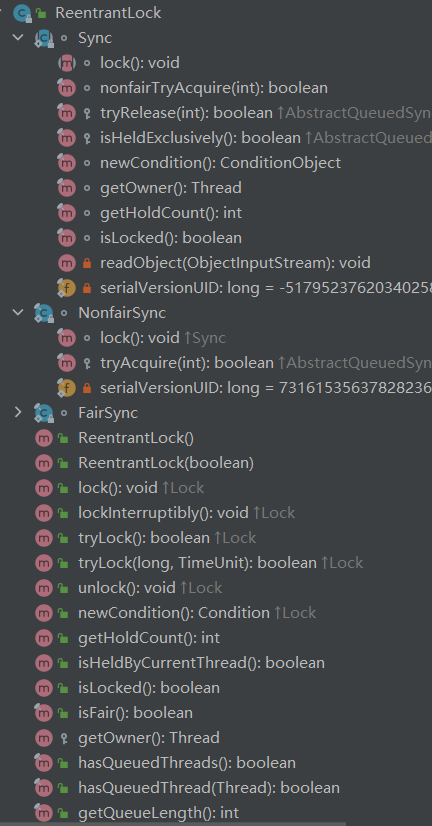
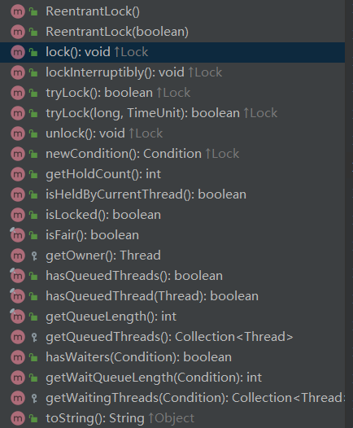

# Java并发之ReentrantLock

## 初始ReentrantLock

ReentrantLock是由Java语言实现，基于 AQS(AbstractQueuedSynchronizer)来实现的，是一个重入锁：一个线程获得了锁之后仍然可以反复的加锁，不会出现自己阻塞自己的情况。

AQS 是 Java 并发包里实现锁、同步的一个重要的基础框架。

ReentraantLock是通过一个FIFO的等待队列来管理获取该锁所有线程的。在“公平锁”的机制下，线程依次排队获取锁；而“非公平锁”在锁是可获取状态时，不管自己是不是在队列的开头都会获取锁。

？ 为什么Synchronized是可重入的


## 比较Synchronized

|  | ReentrantLock   | Synchronized |
| :-----| :---- | :---- |
| 锁实现机制 | 依赖AQS | 监视器模式|
| 灵活性 | 支持响应中断、超时、获取锁| 不灵活 |
| 释放形式 | 显式unlock释放锁 | 自动释放监视器 |
| 锁类型 | 公平锁和非公平锁(默认)| 非公平锁|
| 条件队列 | 可关联多个条件队列 | 关联一个条件队列 |
| 可重入性 | 可| 可|


ReentrantLock是一个可重入的互斥锁，又被称为“独占锁”。ReentrantLock 类实现了 Lock ，它拥有与 synchronized 相同的并发性和内存语义，但是添加了类似锁投票、定时锁等候和可中断锁等候的一些特性。此外，它还提供了在激烈争用情况下更佳的性能。（换句话说，当许多线程都想访问共享资源时，JVM 可以花更少的时候来调度线程，把更多时间用在执行线程上。）

## 源码解析

```
public class ReentrantLock implements Lock, java.io.Serializable;
```


### 成员变量

```
private final Sync sync;
```




### 构造函数

```
public ReentrantLock() {sync = new NonfairSync(); // 默认是非公平锁}

public ReentrantLock(boolean fair) {sync = fair ? new FairSync() : new NonfairSync();} // true: 公平锁
```

### 成员函数



### 非公平锁

公平锁需要关心队列的情况，得按照队列里的先后顺序来获取锁(会造成大量的线程上下文切换)，而非公平锁则没有这个限制。

所以也就能解释非公平锁的效率会被公平锁更高。

关于公平锁与非公平锁的详细介绍可以参考：

#### 获取锁

非公平锁：抢占模式，每来一个人不会去管队列如何，直接尝试获取锁

```
final void lock() {
	// 直接尝试获取锁
	/**
	 * AQS 中的state : 标识同步状态
	 * 0： expected value； 1： update value
	 */
	if (compareAndSetState(0, 1))
		setExclusiveOwnerThread(Thread.currentThread());
	else
        	acquire(1); // AQS中实现
}

protected final boolean tryAcquire(int acquires) {
	return nonfairTryAcquire(acquires);
}

```

- 注意01： acquire(arg) 函数的实现

```
// AQS
public final void acquire(int arg) {
	if (!tryAcquire(arg) &&acquireQueued(addWaiter(Node.EXCLUSIVE), arg))
		selfInterrupt();
}
```
- 注意02：nonfairTryAcquire(args): 非公平锁获取锁的过程

```
 /**
  * Performs non-fair tryLock.  tryAcquire is implemented in
  * subclasses, but both need nonfair try for trylock method.
  */
final boolean nonfairTryAcquire(int acquires) {
	final Thread current = Thread.currentThread();
	int c = getState();
	if (c == 0) {
		// 没有 !hasQueuedPredecessors() 判断
		if (compareAndSetState(0, acquires)) {
			setExclusiveOwnerThread(current);
			return true;
		}
	}
	else if (current == getExclusiveOwnerThread()) {
		int nextc = c + acquires;
		if (nextc < 0) // overflow
			throw new Error("Maximum lock count exceeded");
		setState(nextc);
		return true;
	}
	return false;
}
```

#### 释放锁

公平锁和非公平锁在释放锁的过程中一样的

```
public void unlock() {sync.release(1);}
```

```
public final boolean release(int arg) {
	if (tryRelease(arg)) { // 释放锁成功
		Node h = head;
		if (h != null && h.waitStatus != 0)
			// //唤醒被挂起的线程
			unparkSuccessor(h);
			return true;
	}
	return false;
}

// 尝试释放锁
protected final boolean tryRelease(int releases) {
	// 获取同步状态
	int c = getState() - releases;
	if (Thread.currentThread() != getExclusiveOwnerThread())
		throw new IllegalMonitorStateException();
		boolean free = false;
	// 同步状态为0的时候，锁才成功被释放
	if (c == 0) {
		free = true;
		setExclusiveOwnerThread(null);
	}
	// 锁未被释放，更新同步状态
	setState(c);
	return free;
}

```
### 公平锁

#### 获取锁

公平锁获取锁是直接实现了tryAcquire()， 对比非公平锁，tryAcquire()的真正实现是sync内部由nonfairTryAcquire()实现的

```
/**
 * Fair version of tryAcquire.  Don't grant access unless
 * recursive call or no waiters or is first.
 */
protected final boolean tryAcquire(int acquires) {
	final Thread current = Thread.currentThread();
	int c = getState(); // AQS: state 是否等于 0，0 表示目前没有其他线程获得锁
	if (c == 0) {
		if (!hasQueuedPredecessors() &&compareAndSetState(0, acquires)) {
			setExclusiveOwnerThread(current);
			return true;
		}
	}
	else if (current == getExclusiveOwnerThread()) {
		int nextc = c + acquires;
		if (nextc < 0)
			throw new Error("Maximum lock count exceeded");
		setState(nextc);
		return true;
	}
	return false;
}
```

- 注意01：hasQueuedPredecessors() 方法来判断 AQS 的队列中中是否有其他线程，如果有则不会尝试获取锁(这是公平锁特有的情况)。

- 注意02：队列中没有线程就利用 CAS 来将 AQS 中的 state 修改为1，也就是获取锁，获取成功则将当前线程置为获得锁的独占线程(setExclusiveOwnerThread(current))。

- 注意03：如果 state 大于 0 时，说明锁已经被获取了，则需要判断获取锁的线程是否为当前线程(ReentrantLock 支持重入)，是则需要将 state + 1，并将值更新。

#### 释放锁

释放锁的过程同非公平锁一样


以上公平锁与非公平锁的实现原理还是在AQS中， 详细AQS的源码解析参考另一个笔记：AQS的源码分析

